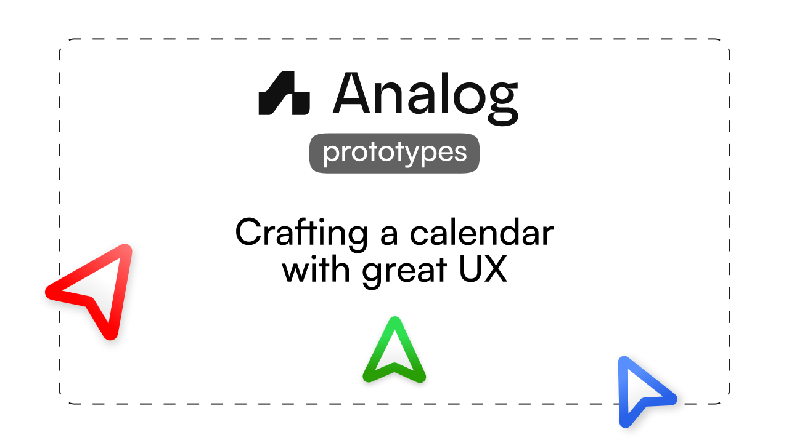

# Analog Prototypes



<br>

> **⚠️ This is not the primary repository** - For active development, bug reports, and feature requests, please visit the [main Analog repository](https://github.com/analogdotnow/Analog).

Experimental UI components and patterns for [Analog Calendar](https://analog.now). We use this space to test ideas and gather feedback before integrating features into the main application.

## 🚀 Quick Start

```bash
pnpm install
pnpm dev
```

## 📁 Structure

```
src/
├── prototypes/           # Your prototypes here (~)
│   ├── your-prototype/
│   │   ├── main.tsx      # Required
│   │   └── settings.tsx  # Optional
│   └── index.ts          # Register prototypes
├── global/               # Rarely touched
│   └── components/
│   │   └── ui/           # shadcn components go here
├── root.tsx              # Entry point with router
└── app.tsx               # Main layouts for the app
```

**Aliases**: `@` = global, `~` = prototypes  

## Adding a Prototype

1. **Create directory**: `src/prototypes/your-prototype/`

2. **Register in `index.ts`**:
```tsx
{
  id: "your-prototype",
  name: "Display Name",
  description: "What it does",
  component: lazy(() => import("./your-prototype/main")),
}
```

3. **Visit**: `/proto/your-prototype`

## UI Resources

- **[originui.com](https://originui.com)** - Our main component library
- **[motion-primitives.com](https://motion-primitives.com/docs)** - Animation components
- **[animate-ui.com](https://animate-ui.com/docs)** - More animations
- **[21st.dev](https://21st.dev/home)** - Collection of shadcn-compatible resources

## Available Tech

React Router v7 • Jotai • Tailwind • Motion • Vercel AI SDK • Zod • Tanstack Form


## Review process

Since this is not the primary repository, reviewing is much less strict. You can propose anything interesting and we'll merge it quite fast.

